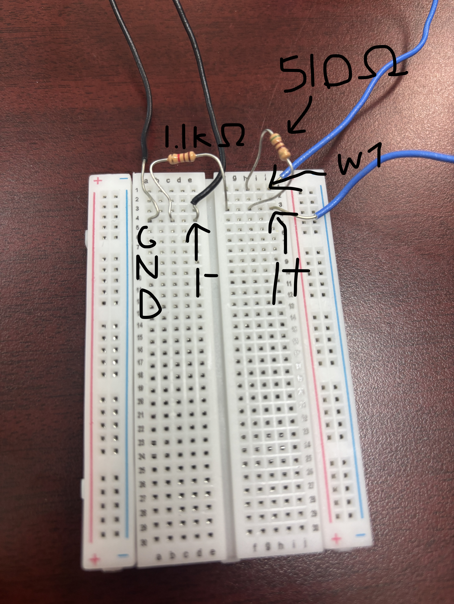
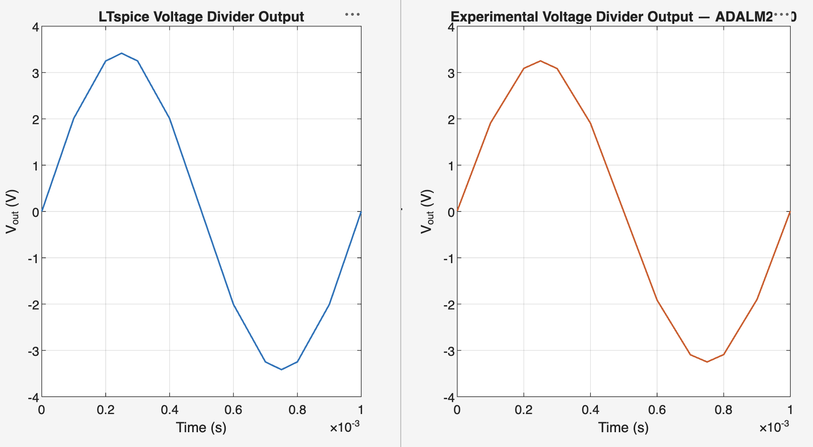

# ECSE 2010 Proof of Skills

This repository contains selected work for ECSE 2010. It includes circuit simulations in LTspice, MATLAB scripts and plots, and physical measurements made with an ADALM2000 (M2K).

## Main circuit

The main physical circuit is a voltage divider made with a 510 ohm resistor and a 1.1 kohm resistor. The M2K provides the input signal and Scopy measures the divider output.

## Example MATLAB comparison

This figure compares a simulated divider waveform with an experimental M2K waveform.

## Folders

- `pdf/experimental` - Function generator and physical voltage/current/waveform measurements.
- `pdf/simulation` - LTspice DC, transient, cursor, parametric, and AC analysis evidence.
- `pdf/matlab` - MATLAB Onramp certificate, analytical plots, LTspice import work, and integration comparison.
- `matlab` - MATLAB scripts used for time constant, sinusoid, linear-system, LTspice-import, and regression work.

## What I learned

- Used a breadboard and ADALM2000 to measure a real voltage divider.
- Compared hardware measurements with ideal circuit calculations and LTspice results.
- Exported data from LTspice and Scopy for MATLAB visualization.
- Used MATLAB for exponential decay, sinusoid, linear-system, import, and regression analysis.
